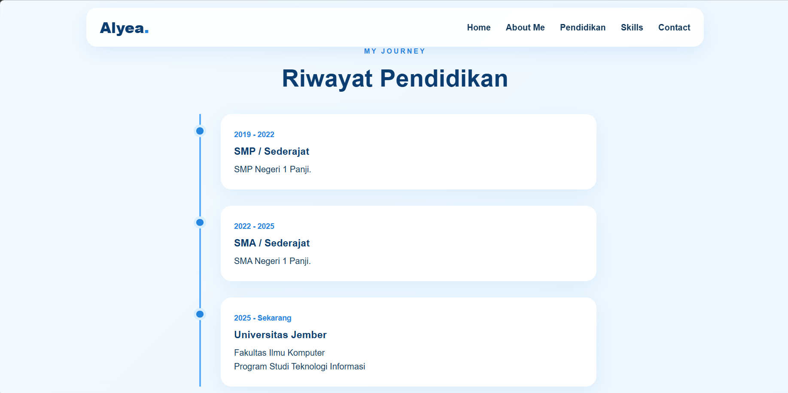
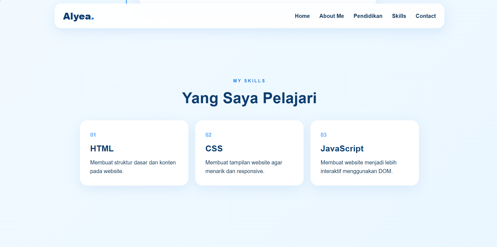

# TUGAS WEB MEMBUAT WEBSITE (PORTOFOLIO)

Website yang saya buat ini merupakan website portofolio sederhana untuk memenuhi tugas Slicing Website mata kuliah Pemrograman Web. Portofolio ini menampilkan profil singkat saya sebagai mahasiswa Teknologi Informasi Universitas Jember, dilengkapi dengan riwayat pendidikan, skills yang sedang dipelajari, serta tautan menuju sosial media.

Website ini memiliki beberapa bagian, yaitu Home yang berisi perkenalan singkat dan foto profil, About Me yang berisi informasi tentang saya, Riwayat Pendidikan, Skills, dan Contact yang berisi tautan sosial media. Website dibuat menggunakan HTML, CSS, dan JavaScript. JavaScript digunakan untuk menambahkan interaksi seperti menu navigasi pada tampilan mobile, animasi saat halaman di-scroll, dan menampilkan tahun secara otomatis pada footer.

## Tampilan Web

### Desktop







## Teknologi yang Digunakan

- HTML
- CSS
- JavaScript

## Responsive

Website dibuat responsive sehingga dapat menyesuaikan ukuran layar desktop, tablet, dan mobile.

Pada ukuran layar yang lebih kecil, tampilan menu navigasi akan berubah menjadi menu hamburger agar lebih mudah digunakan.

## Struktur File

```text
tugas1pweb_alyaa_2025/
├── index.html
├── README.md
├── desktop-home.png
├── desktop-about.png
├── desktop-education.png
├── desktop-education2.png
├── desktop-education3.png
├── profile.jpg
├── script.js
└── style.css